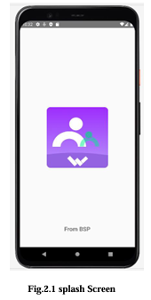
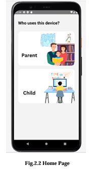
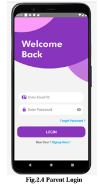
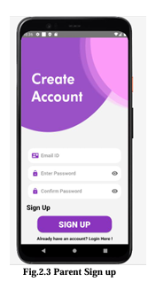
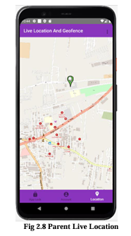
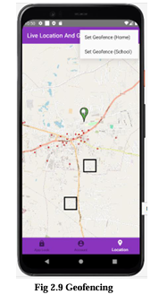
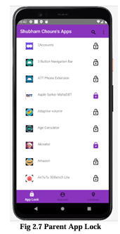
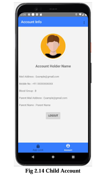

<div align="center">


# Parental Control App

**Real-time child safety for the digital age — built for Android**

[](https://developer.android.com)
[](https://www.java.com)
[](https://firebase.google.com)
[-brightgreen?style=flat-square)](https://developer.android.com/about/versions/marshmallow)
[](LICENSE)
[](https://www.irjmets.com)

<br/>

[📱 Features](#-features) • [🚀 Quick Start](#-quick-start) • [📸 Screenshots](#-screenshots) • [🏗️ Architecture](#️-architecture) • [🤝 Contributing](#-contributing)

</div>
---

## What is this?

A **two-sided Android app** — one interface for parents, one for children — that works together over Firebase to give parents real-time visibility and control over their child's phone.

No subscriptions. No cloud fees beyond Firebase free tier. Open source.

```
Parent's Phone                          Child's Phone
──────────────                          ─────────────
📍 See live location      ◄──Firebase──►  📡 Broadcasts GPS
🔒 Lock/unlock apps       ◄──Firebase──►  🔐 Apps get locked
🗺️  Set geofence zones    ◄──Firebase──►  🔔 Alerts triggered
```
---

## ✨ Features

### For Parents
- **Live Location Map** — See exactly where your child is, updated in real-time on Google Maps
- **Geofencing** — Draw a virtual boundary around Home or School; get an alert + sound when the child crosses it
- **Remote App Lock** — Lock any app on the child's phone with a pattern/PIN, right from your device
- **Push Notifications** — Instant alerts for geofence events, no manual checking required

### For Children
- **Background Location Sharing** — Runs silently in the background, shares GPS with parent
- **App Locker** — Shows which apps are currently locked by the parent
- **Account Info** — View linked parent details and personal profile

### Auth & Security
- Email + Password registration with Firebase Auth
- Forgot Password via email reset link
- Pattern-based PIN for app lock protection
- All data encrypted in transit via Firebase

---

## 📸 Screenshots

<table>
  <tr>
    <td align="center">
      <br/>
      <sub><b>Splash</b></sub>
    </td>
    <td align="center">
      <br/>
      <sub><b>Role Select</b></sub>
    </td>
    <td align="center">
      <br/>
      <sub><b>Parent Login</b></sub>
    </td>
    <td align="center">
      <br/>
      <sub><b>Parent Sign Up</b></sub>
    </td>
  </tr>
  <tr>
    <td align="center">
      <br/>
      <sub><b>Live Location</b></sub>
    </td>
    <td align="center">
      <br/>
      <sub><b>Geofence Setup</b></sub>
    </td>
    <td align="center">
      <br/>
      <sub><b>App Lock List</b></sub>
    </td>
    <td align="center">
      <br/>
      <sub><b>Child Home</b></sub>
    </td>
  </tr>
</table>

---

## 🚀 Quick Start

### Prerequisites
- Android Studio (Hedgehog or newer)
- Java 8+
- A [Firebase](https://console.firebase.google.com) project
- A [Google Maps API Key](https://console.cloud.google.com)

### 1. Clone
```bash
git clone https://github.com/omkarjagtap120/Parental-Control-Android-Application.git
cd Parental-Control-Android-Application
```

### 2. Firebase Setup
1. Create a Firebase project at [console.firebase.google.com](https://console.firebase.google.com)
2. Add an Android app using your package name
3. Download `google-services.json` → paste it into `/app/`
4. Enable these services in Firebase Console:

| Service | Purpose |
|---|---|
| Authentication (Email/Password) | Login & Sign Up |
| Realtime Database | Live location sync, app lock commands |
| Cloud Storage | Profile photos |

### 3. Add your Maps API Key
In `AndroidManifest.xml`:
```xml
<meta-data
    android:name="com.google.android.geo.API_KEY"
    android:value="YOUR_API_KEY_HERE" />
```

### 4. Firebase Realtime Database Rules
Paste this into Firebase Console → Realtime Database → Rules:
```json
{
  "rules": {
    "users": {
      "$uid": {
        ".read": "$uid === auth.uid",
        ".write": "$uid === auth.uid"
      }
    },
    "locations": {
      "$uid": {
        ".read": "auth != null",
        ".write": "$uid === auth.uid"
      }
    },
    "applock": {
      "$uid": {
        ".read": "auth != null",
        ".write": "auth != null"
      }
    }
  }
}
```
### 5. Build & Run
Open in Android Studio → connect a physical device or start an emulator → press ▶
---

## 🏗️ Architecture

```
app/
├── activities/
│   ├── SplashActivity.java
│   ├── HomeActivity.java                 # Role selection screen
│   ├── parent/
│   │   ├── ParentLoginActivity.java
│   │   ├── ParentSignUpActivity.java
│   │   ├── ParentDashboardActivity.java
│   │   ├── LiveLocationActivity.java     # Google Maps + Geofence
│   │   └── AppLockActivity.java          # Remote app locking
│   └── child/
│       ├── ChildLoginActivity.java
│       ├── ChildSignUpActivity.java
│       ├── ChildDashboardActivity.java
│       └── LocationBroadcastService.java # Background GPS service
├── models/
│   ├── User.java
│   └── AppInfo.java
├── utils/
│   ├── FirebaseHelper.java
│   └── GeofenceHelper.java
└── res/
    ├── layout/                           # XML UI files
    └── values/                           # Colors, strings, styles
```

### Data Flow
```
Child GPS  →  LocationBroadcastService  →  Firebase Realtime DB  →  Parent Map
                                                    ↑
                               Parent App Lock Command  →  Firebase  →  Child AppLock
```
---

## 🛠️ Tech Stack

| Layer | Tool |
|---|---|
| Language | Java |
| UI | XML Layouts |
| Backend & Auth | Firebase (Realtime DB + Auth + Storage) |
| Maps & Geofence | Google Maps SDK + Geofencing API |
| Database | MySQL (local user data) |
| Design | Figma |
| IDE | Android Studio |

---

## 📋 Minimum Requirements

| Requirement | Value |
|---|---|
| Android Version | Marshmallow (API 23+) |
| RAM | 1 GB minimum |
| Storage | 8 GB minimum |
| Permissions needed | Location, Internet, Package Query, Overlay |

---

## 🔐 Permissions Used

```xml
<uses-permission android:name="android.permission.ACCESS_FINE_LOCATION" />
<uses-permission android:name="android.permission.ACCESS_BACKGROUND_LOCATION" />
<uses-permission android:name="android.permission.INTERNET" />
<uses-permission android:name="android.permission.QUERY_ALL_PACKAGES" />
<uses-permission android:name="android.permission.SYSTEM_ALERT_WINDOW" />
<uses-permission android:name="android.permission.FOREGROUND_SERVICE" />
```
---
## 🤝 Contributing

Contributions, issues, and feature requests are welcome!

### Open Ideas
- [ ] Screen time limit enforcement
- [ ] Browser / website content filtering
- [ ] Daily usage report with charts
- [ ] SOS / panic button for child
- [ ] Multi-child support under one parent account
- [ ] Dark mode UI

---

## 📄 License

MIT License — free to use, modify, and distribute with attribution.

---

## 👥 Authors

| Name | GitHub |
|---|---|
| Omkar Jagtap | [@omkarjagtap120](https://github.com/omkarjagtap120) |
| Shubham Choure | — |
| Anandi Bhosale | — |
| Shrutika Pardeshi | — |

> 📰 Research paper published in **IRJMETS** — Vol. 06, Issue 01, January 2024 | Impact Factor 7.868

---

<div align="center">

If this project helped you, drop a ⭐ — it helps others find it too.

</div>
